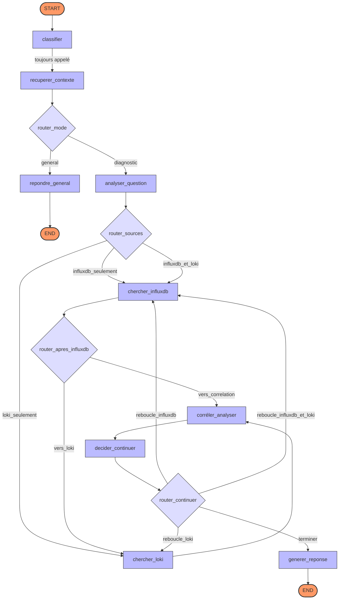

```mermaid
graph TD
    classDef startEnd fill:#f96,stroke:#333,stroke-width:2px;
    classDef process fill:#bbf,stroke:#333,stroke-width:1px;
    classDef decision fill:#ddf,stroke:#333,stroke-width:1px;

    START([START])
    END1([END])
    END2([END])

    classifier[classifier]
    recuperer_contexte[recuperer_contexte]
    router_mode{"router_mode"}

    repondre_general[repondre_general]
    analyser_question[analyser_question]
    router_sources{"router_sources"}

    chercher_influxdb[chercher_influxdb]
    chercher_loki[chercher_loki]
    router_apres_influxdb{"router_apres_influxdb"}

    correler_analyser["corréler_analyser"]
    decider_continuer[decider_continuer]
    router_continuer{"router_continuer"}

    generer_reponse[generer_reponse]

    START --> classifier
    classifier -->|toujours appelé| recuperer_contexte
    recuperer_contexte --> router_mode

    router_mode -->|general| repondre_general
    repondre_general --> END1

    router_mode -->|diagnostic| analyser_question
    analyser_question --> router_sources

    router_sources -->|influxdb_seulement| chercher_influxdb
    router_sources -->|influxdb_et_loki| chercher_influxdb
    router_sources -->|loki_seulement| chercher_loki

    chercher_influxdb --> router_apres_influxdb

    router_apres_influxdb -->|vers_correlation| correler_analyser
    router_apres_influxdb -->|vers_loki| chercher_loki

    chercher_loki --> correler_analyser

    correler_analyser --> decider_continuer
    decider_continuer --> router_continuer

    router_continuer -->|terminer| generer_reponse
    generer_reponse --> END2

    router_continuer -->|reboucle_influxdb| chercher_influxdb
    router_continuer -->|reboucle_influxdb_et_loki| chercher_influxdb
    router_continuer -->|reboucle_loki| chercher_loki

    class START,END1,END2 startEnd
    class classifier,recuperer_contexte,repondre_general,analyser_question,chercher_influxdb,chercher_loki,correler_analyser,decider_continuer,generer_reponse process
    class router_mode,router_sources,router_apres_influxdb,router_continuer decision
```
